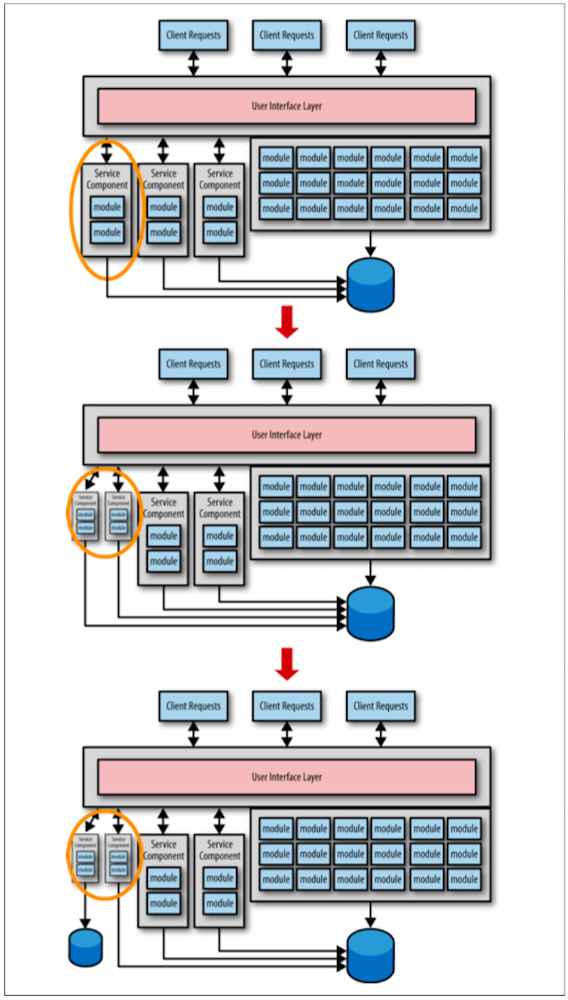

## 機能を最初に、データは最後に

このアンチパターンを避けるには、主に最初にサービスの機能を移行し、サービスとデータ間の境界付けられたコンテキストについては後で考える手法があります。
一度サービスについて熟知してしまえば、サービス統合または分割粒度の度合いの調整が必要だとわかるでしょう。
粒度の度合いが適正化された後にデータを移行し、その結果、サービスとデータそれぞれの間に本当に必要な境界付けられたコンテキストが設けられます。

このテクニックについて、図1-3に記載しています。３つのサービスが移行されていますが、モノリシックなデータと接続している状態です。
暫定的な対応策としては完璧です。サービスがどのように利用されるのか、各サービスによってどのような形式のリクエストが扱われるのかを把握できるからです。

  
図1-3. サービス機能の移行を最初に、データ部分は後に

図1-3で、サービスの粒度が荒すぎるとわかってからどのようにして、結果的に２つのより小さなサービスに分割したのかに注目してください。
粒度が適切になってようやく、サービスとそれに対応するデータぞれぞれの間に境界付けられたコンテキストを設けるためにデータを移行することができます。
この手法では、コストのかかる繰返しのデータ移行を避けることができ、必要に応じてサービス粒度を調整しやすくなります。
データ移行までにどのくらいの期間待つのかは明言できませんが、この回避策の結果（つまり、境界付けられたコンテキストが不十分な状態）について理解することが重要です。
サービスが作られてからデータが最終的に移行されるまでの期間は、サービス間でデータ結合が発生します。
データベーススキーマに変更が発生した時は、そのスキーマを参照する全サービスも変更管理からリリースの考え方まで調整しなければならないことを意味しています。
マイクロサービスアーキテクチャを避けたくなるようなことです。
しかしながら、この見返りとして、多発してコストのかかるデータベース移行に関わるリスクを低減する価値があるのです。

