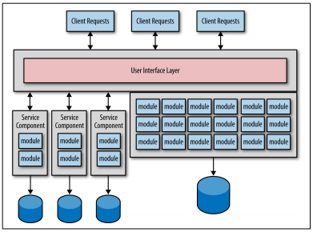

### CHAPTER 1

# データ駆動型移行アンチパターン

マイクロサービスとは、小さく、分散した単一の目的を持つサービスを沢山作ることです。
各サービスは各々が自身固有のデータを保持します。
これらのサービスやデータの組み合わせは、境界づけられたコンテキストやシェアード・ナッシング・アーキテクチャの概念を支えています。
つまり、各サービスやそれらに対応するデータが区画化され、全ての他サービスから完全に独立しており、明確に定義されたインタフェース（契約）のみを公開します。
この境界づけられたコンテキストによって、開発やテストが素早く、簡単にできるようになり、デプロイ時の依存関係を最小限にすることが可能です。

データ駆動型移行アンチパターンは、大抵の場合、モノリシックアプリケーションからマイクロサービスアーキテクチャへと移行する中で起こります。
データ駆動型移行がアンチパターンなのは、マイクロサービス作成時に、サービスの機能とそれに対応するデータを併せて移行し始めるには良いアイデアのように見えてしまうからです。
しかし、本章を読み進めることで、この手法が、結果的に高いリスクを背負う羽目になり、コストは浪費し、移行に余計な労力をかけさせられてしまうことが分かると思います。

マイクロサービスへ頑張って変換することには、2つの主要な目的があります。
１個目の目的は、モノリシックアプリケーションの機能を、小さく単一の機能のみ持つサービス群に分割することです。
２個目の目的は、モノリシックなデータをサービス単位に保有する小さなデータベース群（または分割されたスキーマ群）へと移行することです。
図1-1にサービスロジックとそれに対応するデータが同時に移行される際の典型的な移行例を記載します。

  
図1-1. サービスとデータの移行

3つの独立したデータベースに加えて、モノリシックアプリケーションから3つのサービスが作成されていることに注目して下さい。
これは、いたって自然な移行プロセスです。各サービス、データそれぞれの間に決定的な境界づけられたコンテキストが設けられているからです。
しかし、問題はこの一般的な方法で発生します。それ故に、あなたはデータ駆動型移行アンチパターンに陥ってしまうのです。