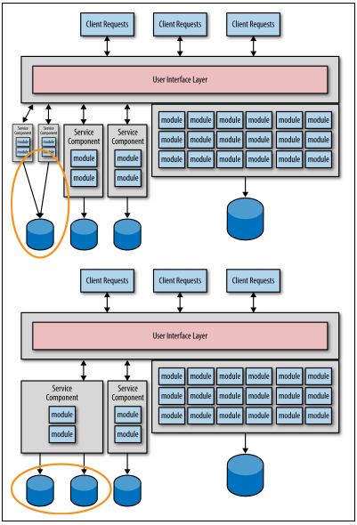

## 膨大なデータ移行

この移行プロセスでは、最初は各サービスの正確な粒度をほとんど掴めないことが主な問題です。
粒度の大きいサービスから始めて、そのサービスについてより熟知した際に、
必要であれば分割するのが良いということを分かっていれば、サービスの粒度を頻繁に調整できるでしょう。
図1-1 の移行パターンについて、左側のサービスに焦点を当てて考えてみましょう。
例えば、そのサービスについて熟知した後に、粒度が大きすぎるため2つのより小さなサービスに分割する必要があるとしましょう。
あるいは、左側の2つのサービス粒度が細かすぎて統合する必要がある場合でも構いません。
どちらにせよ、移行に際してサービスの機能とデータベースそれぞれで苦労することになります。
概要を図1-2に記載します。

  
図1-2. サービス粒度調整後の余分なデータ移行

私の親友であり、同じオライリーの著者であるAlan Beaulieu（『初めてのSQL』の著者）は、かつて私に
”データは企業資産であり、アプリケーション資産ではない。”と言いました。
Alanの主張から、継続的なデータ移行にはリスクや懸念が存在することが分かります。
データ移行は、ソースコード移行よりも複雑かつミスが起こりやすいのです。各サービスのデータ移行は1回で済ませるのが最適です。
このアンチパターンを避けるための第一歩は、データ移行にはリスクが潜むことと、”機能よりもデータ”が重要であることを理解することです。