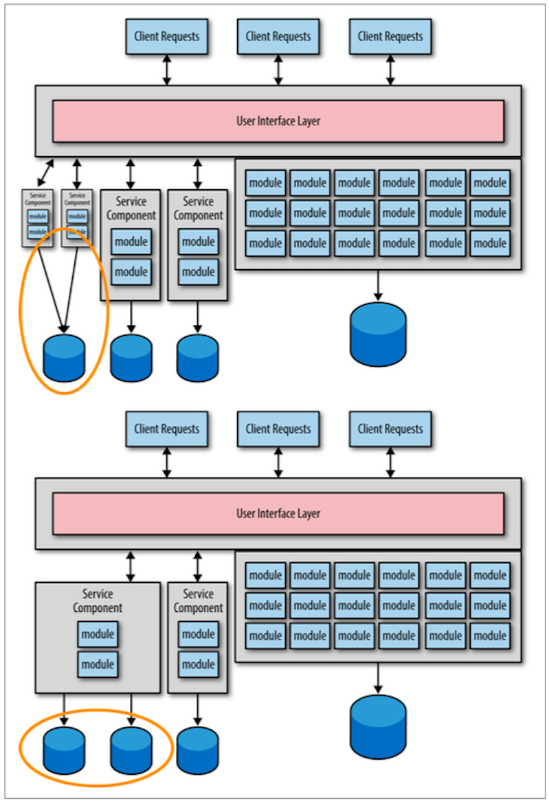

## Too Many Data Migrations

この移行プロセスでは、最初は各サービスの正確な粒度をほとんど掴めないことが主な問題です。  
粒度の大きいサービスから始めて、そのサービスについてより詳しくなった際に、必要であれば分割するのが良いということを分かっていれば、サービスの粒度を頻繁に調整できるかも知れません。  
図1-1 の移行パターンについて、左側のサービスに焦点を当てて考えてみましょう。  
例えば、そのサービスについて詳しくなった後に、粒度が大きすぎるため、2つのより小さなサービスに分割する必要があるとしましょう。  
あるいは、一番左側の2つのサービスの粒度が細かすぎて、統合する必要がある場合でも構いません。  
どちらにせよ、移行に当たって、サービス機能性とデータベースの2つの苦労に直面します。  
概要を図1-2に記載します。  
  
図1-2. サービス粒度調整後のデータ移行  

私の親友であり、同じオライリーの著者であるAlan Beaulieu（『初めてのSQL』の著者）は、かつて私に”データは企業資産であり、アプリケーション資産ではない。”と言いました。  
Alanの主張から、継続的なデータ移行にはリスクや懸念事項が存在することが分かります。  
データ移行は、ソースコード移行よりも複雑かつ、ミスが起こりやすいのです。  
各サービスのデータ移行は1回で済ませるのが最適です。  
このアンチパターンを避けるための第一歩は、データ移行にはリスクが潜むことと、”機能よりもデータ”が重要であることを理解することです。  