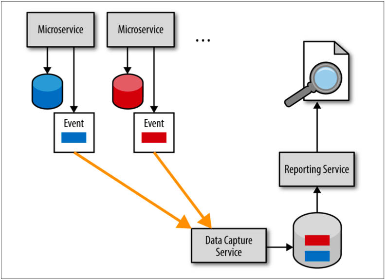
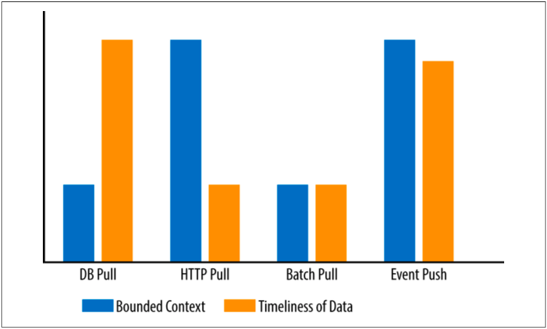

## 非同期イベントプッシュ

リーチインレポートアンチパターンの回避策は、イベントベースプッシュモデルと呼ばれるものを使用することです。
Sam Newmanは、彼の著書である『マイクロサービスアーキテクチャ』の中で、この技術をデータ・ポンプと呼んでいます。
図4-4に示すこのモデルでは、非同期イベント処理を利用して、レポートデータベースにできるだけ早く適切な情報が提供されるようにしています。

  
図4-4. イベントベースプッシュレポートモデル

イベントベースのプッシュモデルは比較的実装が複雑ですが、各サービスの境界付けられたコンテキストを保持すると同時に妥当なデータの即時性も保証します。
バッチプルモデルと同様に、このモデルにはレポートサービスが所有する独立したレポートデータベースがあります。
しかしながら、各マイクロサービスは、バッチプロセスによるデータ取得ではなく、
重要なデータ更新（レポートサービスが必要とするデータ等）を独立したイベントとして非同期でデータ収集サービスに送信します。
その後、データ収集サービスはデータを要約してレポートデータベースを更新します。

イベントベースのプッシュモデルでは、非同期に送信するデータに対して、各マイクロサービスとデータ収集サービス間の契約が必要ですが、
その契約はそのサービスが所有するデータベーススキーマからは独立しています。
しかしながら、各サービスがレポートのために何の情報をいつ送信するか把握する必要がある点で、サービスは少しだけ結合されてしまいます。

図4-5のグラフを見ると、データベースプルモデルはデータの即時性を最大化しますが、境界付けられたコンテキストを破壊していることが分かります。
HTTPプルモデルでは、境界付けられたコンテキストは保持されますが、タイムアウトやデータ量に関する問題があります。
バッチプルモデルは、境界付けられたコンテキストもデータの即時性も最適化しないため、4つの選択肢の中で最も望ましくないモデルです。
イベントベースプッシュモデルのみ、各サービスの境界付けられたコンテキストとレポートデータの即時性の両方を最大化します。

  
図4-5. レポートモデル比較