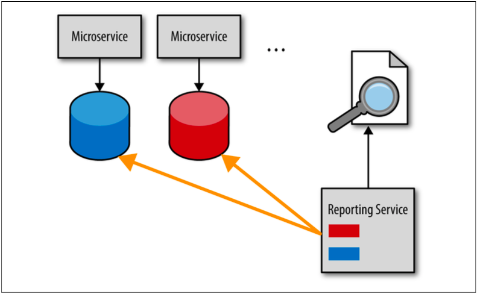

## マイクロサービスのレポートに関する問題

レポートの問題は2つの要素があります。タイムリーにレポートデータを取得するにはどうすればよいかと、
そうした場合でもどのようにサービスとそのデータの間の境界付けられたコンテキストを維持するのかです。
マイクロサービス内の境界付けられたコンテキストにはサービスとそれに対応するデータが含まれており、
それを維持することが非常に重要だということを覚えておいてください。

マイクロサービスアーキテクチャで通常扱われるレポート出力の手段の1つに、データベースプルモデルを使用することがあります。
このモデルでは、レポートサービス（またはレポートリクエスト）がサービスデータベースから直接データを取得します。
図4-1にこの手法について記載します。

  
図4-1. データベースプルレポートモデル

