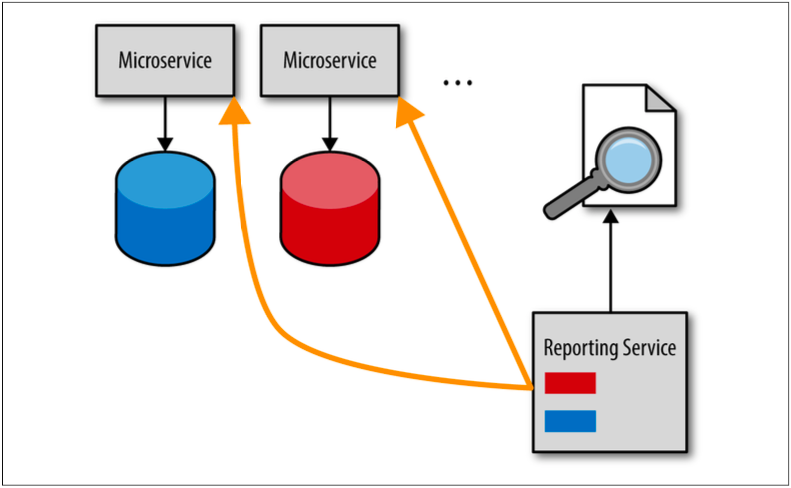

## マイクロサービスのレポートに関する問題

レポートの問題は2つの要素があります。タイムリーにレポートデータを取得するにはどうすればよいかと、
そうした場合でもどのようにサービスとそのデータの間の境界付けられたコンテキストを維持するのかです。
マイクロサービス内の境界付けられたコンテキストにはサービスとそれに対応するデータが含まれており、
それを維持することが非常に重要だということを覚えておいてください。

マイクロサービスアーキテクチャで通常扱われるレポート出力の手段の1つに、データベースプルモデルを使用することがあります。
このモデルでは、レポートサービス（またはレポートリクエスト）がサービスデータベースから直接データを取得します。
図4-1にこの手法について記載します。

  
図4-1. データベースプルレポートモデル

論理的に考えれば、タイムリーなデータを取得する最も迅速かつ簡単な方法は直接アクセスすることです。
これを聞いた時点では良いアイデアのように思えるかも知れませんが、サービスとレポートサービスとの間に大きな相互依存関係が生まれてしまいます。
これは、共有データベースを介してアプリケーションを結合する共有データベース統合形式の典型的な実装です。
この場合、サービスはもはやサービス自身に対応するデータを所有していないことを意味しています。
サービスデータベースのスキーマの変更やリファクタリングを行う際には、レポートサービスも変更しなければなりません。
その結果、サービスとデータ間の重要な境界付けられたコンテキストを破壊してしまうのです。

データ結合の問題を回避する方法は、HTTPプルモデルと呼ばれる別の手法を使うことです。
このモデルでは、レポートサービスは各サービスデータベースに直接アクセスするのではなく、各サービスに静的なHTTP呼出しを行い、データを要求します。
このモデルについて、図4-2に記載します。

  
図4-2. HTTPプルレポートモデル

