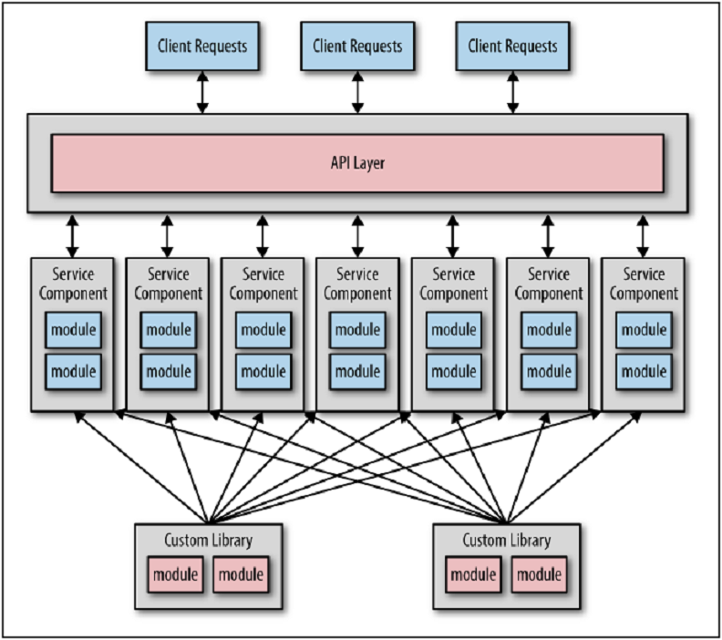

### CHAPTER 3

# ”共有するようにいわれました”アンチパターン

マイクロサービスは、”共有部分が全くない”アーキテクチャとして知られています。
実利的には、私は"共有部分がわずかな"アーキテクチャであると考える方が好きです。
マイクロサービス間で共有されるある程度のコードが常に存在するからです。
例えば、認証と認可を担当するセキュリティサービスを用意するよりもむしろ、
全てのサービスが使用するsecurity.jarというJARファイルにラップされたソースコードとセキュリティ機能を用意しても良いです。
セキュリティがサービスレベルで扱われるとすれば、これは一般的に良い方法です。
なぜなら、全てのリクエストに対してセキュリティサービスへのリモート呼出しを行う必要がなくなり、パフォーマンスと信頼性が向上するからです。

しかし、度が過ぎると図3-1に示されるように、全てのサービスが複数の独自共有ライブラリに依存する依存性の悪夢に行き着くことになります。

  
図3-1. 複数の独自ライブラリの共有

このレベルの共有は、各サービスの境界付けれらたコンテキストを破壊するだけでなく、
全体的な信頼性、変更管理、テスト容易性、およびデプロイを含むさまざまな問題を引き起こします。