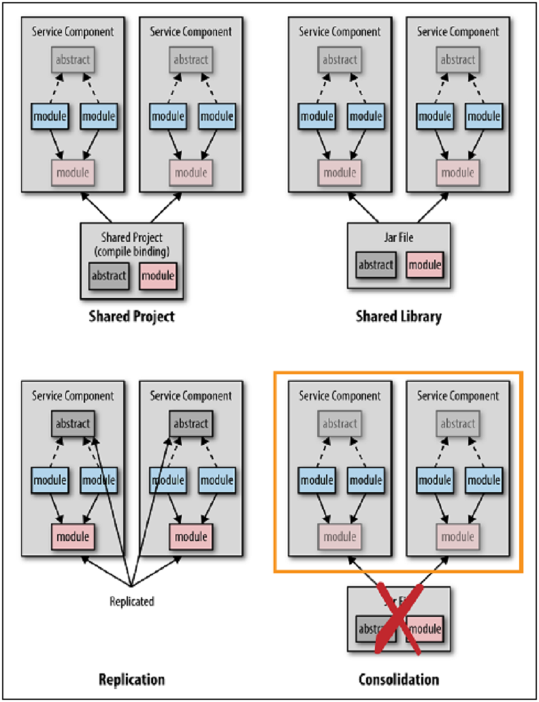

## 共有コードテクニック

このアンチパターンを避ける最良の方法は、単にサービス間でコードを共有しないことだと言うのは簡単です。
しかし、この章の冒頭で述べたように、実際には共有する必要のあるコードが何かしら出てくるでしょう。 その共有コードはどこに置かれるべきでしょうか。

図3-3は、共有コードの問題に対処する4つの基本的なテクニックについて記載しています。
共有プロジェクト、共有ライブラリ、複製、およびサービス統合です。

  
図3-3. モジュール共有テクニック

共有プロジェクトを使用すると、共有プロジェクト内にある共有ソースコードと各サービスプロジェクトがコンパイル時にバインドされます。
これによって、ソフトウェアの変更と開発が容易になりますが、実行中に潜在的な問題や予想だにしない事象を引き起こして
アプリケーションをより脆弱にしてしまうため、私が最も好まない共有テクニックです。
共有プロジェクトの主な問題は、コミュニケーションとコントロールです。
どの共有モジュールが変更されたのか、そしてなぜ変更されたのかを把握することが難しいだけでなく、
その特定の変更を必要とするかどうかをコントロールすることも困難です。
あなたがマイクロサービスをリリースしようとしている時に、誰かが共有モジュールに急な変更を加えたことが分かり、
デプロイの前にコードの変更・再テストが必要になった場合を想像してみてください。

コードを共有する必要がある場合は、共有ライブラリ（.NETアセンブリやJARファイルなど）を使用する方がよいでしょう。
この方法では開発がより困難になります。共有ライブラリ内のモジュールを変更するたびに、
開発者はライブラリの作成、サービスの再起動、再テストを実施する必要があるからです。
しかしながら、共有ライブラリテクニックの利点はライブラリをバージョン管理でき、
サービスのデプロイと実行環境での振舞いをより適切にコントロールできる点にあります。
共有ライブラリーに変更が加えられてバージョンが変更された場合に、サービス所有者はその変更を組み込む時期を決定することができます。

マイクロサービスアーキテクチャで一般的な第3のテクニックは、DRY原則を破って特定の機能を必要とするすべてのサービスに共有モジュールを複製することです。
複製は危険に思えるかもしれませんが、依存関係の共有を回避し、サービスの境界付けられたコンテキストを保持します。
複製されたモジュールを変更する必要がある（特に欠陥の場合）ときに、このテクニックでは問題が発生します。
この場合は、すべてのサービスを修正する必要があります。
したがって、このテクニックは、ほとんどまたはまったく変更のないかなり安定した共有モジュールに対しては非常に便利です。

時には可能である第4のテクニックは、サービスを統合することです。
2つないし3つのサービスがすべて何らかの共通コードを共有しており、それら共通モジュールが頻繁に変更されるとしましょう。
共通モジュールが変更されれば、いずれにせよすべてのサービスをテストしてデプロイする必要があるため、
機能を単一のサービスに統合してもよいでしょう。それによって、依存ライブラリを排除できます。

共有ライブラリに関するアドバイスを一言で言うならば、common.jarのような単一の共有ライブラリにすべての共有コードをまとめることを避けてください。
共通ライブラリを使用すると、共有コードを組み込む必要があるかどうか、そしていつ組み込むべきかを把握しづらくなります。
より良い方法としては、共有ライブラリをコンテキストを持つライブラリ群に分離することです。
例えば、security.jar、persistence.jar、dateutils.jar等のコンテキストベースのライブラリを作成するのです。
これにより、頻繁に変更されないコードと頻繁に変更されるコードが分離され、すぐに変更を組み込むかどうか、そして変更の意図が何かを簡単に判断できます。