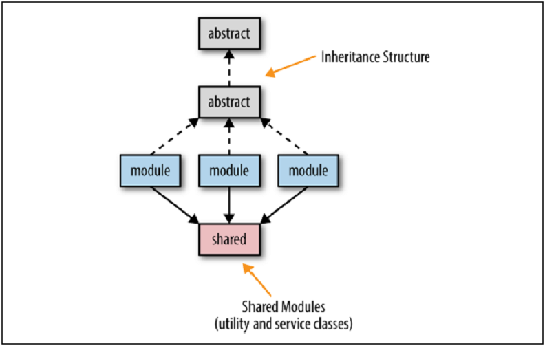

## 膨大な依存関係

大半のオブジェクト指向ソフトウェアアプリケーションがどのように開発されているのかを考えれば、
特にモノリシックでレイヤ化されたアーキテクチャからマイクロサービスアーキテクチャに移行する際の共有に関する問題を理解することは難しくありません。
モノリシックアプリケーションの大半において手間がかかることの１つは、コードの再利用と共有です。
図3-2は、ほとんどのモノリシックでレイヤ化されたアーキテクチャで共有される２つの主要な成果物（抽象クラスと共有ユーティリティ）を示しています。

  
図3-2. 継承構造とユーティリティクラスの共有

抽象クラスやインタフェースの作成は、ほとんどのオブジェクト指向プログラミング言語で一般的に行われていますが、
それらはモジュールをマイクロサービスアーキテクチャに移行しようとするときの妨げとなってしまいます。
共通の日付や文字列、計算ユーティリティのような独自共有クラス、ユーティリティも同様です。

マイクロサービスアーキテクチャの主な目標の１つは、可能な限り共有を避けることです。
これによって、各サービスの境界付けられたコンテキストを保持することができ、迅速なテストとデプロイメントができるようになります。
要するに、マイクロサービスによって制御や依存性を変更するのです。
サービス間の依存関係が増えるほど、サービスの変更を分離するのが難しくなり、個々のサービスを個別にテスト・デプロイすることが難しくなります。
多くと共有しすぎるとサービス間の依存関係が膨大になり、テストとデプロイが極めて困難な脆弱なシステムをもたらします。