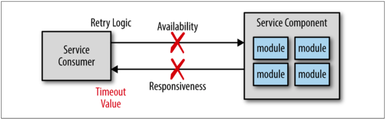

### CHAPTER 2

# タイムアウトアンチパターン

マイクロサービスは分散型アーキテクチャです。つまり、すべてのコンポーネント（サービス）は
独立したアプリケーションとして公開され、何らかのリモートアクセスプロトコル経由でアクセスされることを意味しています。
どの分散型アーキテクチャにおいても課題になることの1つに、リモートプロセスの可用性と応答性の管理があります。
サービスの可用性・応答性はどちらもサービスの通信に関連していますが、その2つは全く異なる事柄です。
サービス可用性は図2-1に示すとおり、サービスコンシューマがサービスに接続し、リクエストを送ることができる能力です。
一方、サービス応答性は、サービスが通信で受け取ったリクエストに対してレスポンスを返すまでにかかった時間を示します。

  
図2-1. サービス可用性と応答性

サービスコンシューマがサービスに接続できない、あるいはサービスと通信できない場合は、
図2-1に示すとおり、通常はサービスコンシューマに数ミリ秒以内に直ちに通知されます。
サービスコンシューマはクライアントにこのエラーを伝達するか、諦めて何らかのコネクションエラーをスローするまで何回か再接続を試みるか選ぶことでしょう。
しかし、サービスに到達し、リクエストが生成されたと仮定して、もしサービスがレスポンスを返さなかったら何が起こるでしょうか。
この場合、サービスコンシューマは無制限に待つか、何らかのタイムアウト値を利用するか選ぶことができます。

サービス応答性のためにタイムアウト値を使用することは良いアイデアのように見えますが、これがタイムアウトアンチパターンとして知られる悪い方向へとあなたを引き込むのです。