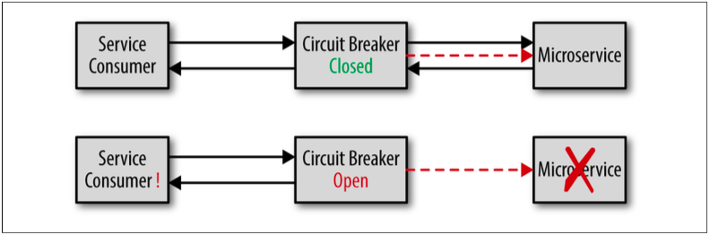

## サーキットブレーカーパターンを使用する

リモートサービス呼出しをタイムアウト値に依存させるよりも、サーキットブレーカーパターンと呼ばれるものを使う方がより良いアプローチです。
このソフトウェアパターンは、まさに家の中のブレーカーのように動作します。
ブレーカーが上がっているとき電気は流れますが、一度ブレーカーが落ちるとブレーカーが上げられるまで電気は全く流れなくなります。
同じ要領で、サービスが応答していないことを検知すると、ソフトウェアのブレーカが落ちて、そのサービスへのリクエストを遮断します。
サービスが応答状態になればブレーカーは上がり、リクエストが通ることができるようになります。

図2-3に、サーキットブレーカーパターンがどのように動作するのかを記載します。
サーキットブレーカーは絶えずリモートサービスを監視して、サービスが生きていること、応答していることを確認します（詳細は後述）。
サービスが応答状態にある限りはブレーカーは上がった状態で、リクエストの通過を許可します。
リモートサービスが突然応答しなくなると、サーキットブレーカーが落ちます。
このようにして、サービスが再び応答状態になるまで、リクエストが通過するのを防止するのです。
しかしながら、家の中のブレーカーとは違って、ソフトウェアのブレーカーはサービスの監視を継続し、リモートサービスが再度応答状態になったら、自身を上げることができます。

  
図2-3. サーキットブレーカーパターン

実装に従い、サービスコンシューマは常にサーキットブレーカーが落ちているのか、上がっているのかを最初に確認します。
サービスコンシューマがリクエスト経路にサーキットブレーカーがあるかを知る必要をなくすために、
この処理をインターセプタパターンによって実施させることも可能です。
いずれにしても、タイムアウト値の分だけ待つよりもサービスコンシューマがサービスが応答していないことが
直ちにわかることがタイムアウト値に勝るサーキットブレーカーパターンの重要な利点です。
前述の例において、タイムアウト値の代わりにサーキットブレーカーが使用されていれば、
取引実行サービスが応答していないことを知るまでに10秒（10000ミリ秒）待たなければならないものが数ミリ秒で知ることができるでしょう。

サーキットブレーカーは様々な方法でリモートサービスを監視することができます。
最もシンプルな方法は、リモートサービスにping等の死活確認を行うことです。
この方法は相対的に容易かつ費用がかかりませんが、ただサーキットブレーカーにリモートサービスが
生きていることを伝えるだけで、実際のサービスリクエストの応答性に関しては何も伝えません。
リクエストの応答性についてより詳細な情報を得るには、合成トランザクションを使うことができます。
合成トランザクションは、サーキットブレーカーが定期的に（例えば10秒ごと）サービスに擬似トランザクションを送信する場合に使える別の監視手法です。
擬似トランザクションがそのサービス内に求められる全ての機能を実行することで、サーキットブレーカーは正確な応答性を計測することができます。
合成トランザクションを把握するために必要となるアプリケーションまたはシステム全ての箇所に実装をするのはかなり手の込んだ難しい作業になる可能性があります。
第3の監視方式は、リアルタイムでユーザを監視することで、実際の本番環境上のトランザクション応答性を監視します。
一度閾値に達すると、ブレーカーはいわゆる半分落ちた状態になり、
特定のトランザクション数（例えば、10トランザクション中1トランザクション）のみ通過させるようになります。
サービス応答性が通常状態に戻ったら、ブレーカーは上がってすべてのトランザクションを通過させるのです。

サーキットブレーカーパターンのオープンソース実装は、NetflixのHystrixやGitHubのplethora等いくつか存在します。
[Akkaフレームワーク](http://akka.io/)にはCircuitBreakerクラスとしてサーキットブレーカー実装が含まれています。

下記の文献にて、サーキットブレーカーについてより詳細な情報を確認することができます。

* Michael Nygardの良著『Release It!』
* Martin Fowlerの[サーキットブレーカーに関するブログ記事](https://martinfowler.com/bliki/CircuitBreaker.html)
* [Microsoft MSDN library](https://msdn.microsoft.com/en-us/library/dn589784.aspx)