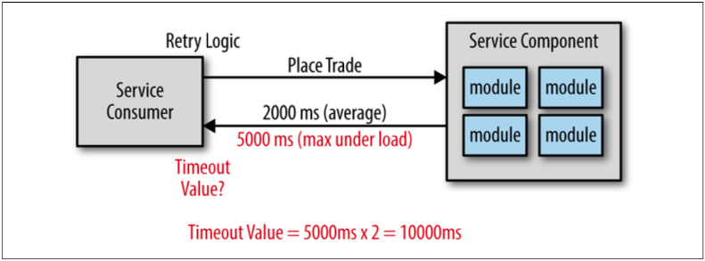

## タイムアウト値を使用する

この点に関して、少し混乱するかも知れません。
結局のところ、タイムアウト値を設定するのは良いことではないのでしょうか。
おそらく、ほとんどの場合で悪い方向へと引き込む可能性があります。
Apple社の株式を1000株購入するリクエストを行うサービスを作成するときの例を考えてみてください。
サービスコンシューマとして最もやりたくないのは、サービスが取引に成功し認証番号を付与しようとしているまさにそのときにリクエストを中断することです。
取引を再実行することができますが、その取引が新規取引なのか重複取引なのかを判断するために、かなり複雑なことをサービスに対して追加しなければなりません。
その上、最初の取引で認証番号を受け取っていないため、その取引が実際に成功したのかどうか確認するのは非常に難しいです。

では、そのリクエストを即座に中断したくないとしたら、タイムアウト値はどうすべきでしょうか。
この問題に対処する手法がいくつかあります。
１つは、サービス内のデータベースタイムアウトを算出し、その値をサービスタイムアウトを決定する基準に利用することです。
こちらの方がはるかに有名な手法ですが2番目の解決方法は、負荷がかかるときの最大の時間を算出、そしてその時間を倍にすることです。
その結果、時折時間のかかるイベントに対して追加のバッファが設けられます。

図2-2にこの手法を記載しています。
取引を行うのに、平均で2秒以内であることに注目してください。
しかし、高負荷時の最大応答時間は5秒です。
なので、倍にする手法を使うと、サービスコンシューマのタイムアウト値は10秒になります。
再三になりますが、この手法の意図は、実際に取引に成功して認証番号を送り返す途中のリクエストを中断するのを避けることです。

  
図2-2. タイムアウト値を算出する

どうしてこのアプローチがアンチパターンなのか、今となっては明確なはずです。
タイムアウト問題に対して、完璧で論理的な解決策のように思えますが、
サービスが応答していないことを判別するためだけに、サービスコンシューマからの全てのリクエストが10秒待機しなければいけなくなります。
エラーを待つのに10秒は長すぎます。
大抵の場合、再度送信ボタンを押す、あるいは諦めて画面を閉じるまで2〜3秒以上もユーザは待ちたくないでしょう。
サービス応答性に対処するもっと良い方法があるはずです。