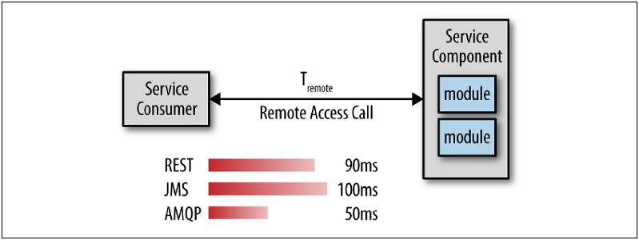

## プロトコルを比較する

相対的なレイテンシは環境や業務リクエストの性質によって大きく異なるため、さまざまな負荷量でさまざまな業務リクエストに関するベンチマークをはっきりさせることが重要です。

  
図9-1. リモートアクセスレイテンシを比較する

図9-1の仮の例を見ると、AMQPは実際にはRESTのほぼ2倍の速さであることがわかります。
この情報を活用して、どのリクエストがどのリモートアクセスプロトコルを使用すべきかに関して賢明な選択をすることができます。
例えば、アプリケーション内のパフォーマンスを向上させるために、クライアントリクエストからマイクロサービスまでの全通信にRESTを使用し、サービス間の通信についてはAMQPを使用するでしょう。

リモートアクセスプロトコルを選択するときの考慮事項はパフォーマンスだけではありません。
第10章で説明するように、メッセージングを活用してアプリケーションに追加の機能を提供することもできます。