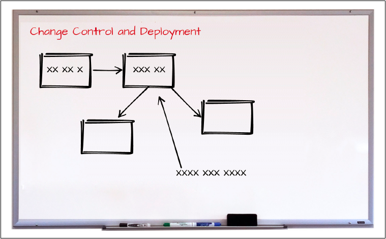

## ビジネス上の推進要因の理解

この落とし穴を避ける鍵となるのは、マイクロサービスを選択するに至るビジネス要件を理解することです。
チームのすべてのアーキテクトと開発者は、以下の各質問の答えを知っていなければなりません。

* なぜマイクロサービスにするのか？
* 最も重視するビジネス上の推進要因はなんなのか？
* アーキテクチャのどんな特徴が最も重要か？

主要なアーキテクチャ特性である展開（デプロイ）性、パフォーマンス、堅牢性、およびスケーラビリティを使用して、ビジネス上の推進要因がわかっている次のシナリオを考えてみましょう。
ビジネス上の推進要因が導くのは、サービスの統合や分割に関する決定であり、アーキテクチャの特性自体ではないことに注目してください。

**シナリオ１：マイクロサービスに移行する理由は、効果的なデプロイメントパイプラインを使用して市場投入時間をより短縮するためです**

このシナリオにおけるビジネス上の推進要因では、各サービスの展開（デプロイ）性がパフォーマンス、堅牢性、およびスケーラビリティよりも重視されるため、
より粒度の細かいサービスが作成され、サービス間通信の潜在的な増加（とその結果としてパフォーマンスと信頼性への影響）を許容するようになります。
図6-1に戻って、この要件で考えると開発者はサービスを統合するという誤った決定をしたことになります。

**シナリオ２：マイクロサービスに移行する理由は、アプリケーション全体の信頼性と検討性を高めるためです**

このシナリオは、企業がモノリシックアプリケーションからマイクロサービスアーキテクチャに移行する一般的な理由で、
これは主に、密結合なモノリシックアーキテクチャと脆弱なアプリケーションの問題に起因しています。
このシナリオでは、ビジネス上の推進要因は、信頼性と堅牢性の必要性を明確に述べています。
つまり、信頼性と堅牢性を向上させるために、恐らくテストとデプロイの容易さを犠牲にすることになり、粒度の細かいサービスよりも
より粗い粒度のサービスが優先されることになります。

私がよく使う手法の１つは、図6-3に示すように、共通のチームホワイトボードの上部に大きな赤い文字でビジネス上の推進要因を書き込む方法です。
そうすると、サービスの粒度やツールの選定をするときチームはいつもホワイトボードを見上げて確認し、
「ああ、そうだね。わかった。さぁ、サービス粒度を細かく保ってパフォーマンスと信頼性の問題に対処する別の方法を考えてみよう。」
ということができるのです。

図6-3. ホワイトボードにビジネス上の推進要因を記述する