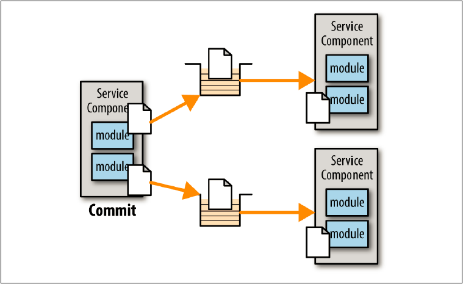

## トランザクションリクエスト

メッセージングシステムはトランザクションメッセージの概念をサポートしています。
つまり、トランザクションコンテキスト内で複数のキューまたはトピックにメッセージを送信した場合、送信者がそのトランザクションをコミットするまで、メッセージは実際にサービスによって受信されません。
図10-3に示すように、サービスコンシューマは最初のサービスにメッセージを送信し、次に別のメッセージを2番目のサービスに送信するとします。
サービスコンシューマがコミットするまで、それらのメッセージはキューに保持されます。サービスコンシューマがコミットすると、両方のメッセージが解放されるのです。

図10-3. メッセージングのトランザクション機能

図10-3のサービスコンシューマが最初のキューにメッセージを送信した後に何らかのエラーが発生した場合、
サービスコンシューマはメッセージングトランザクションをロールバックして、最初のキューからメッセージを効果的に取り除きます。
RESTを使用してこの種のトランザクション機能を実装することは非常に困難であり、
本質的にはサービスコンシューマが各リクエストによって行われた更新を取り消すための補正リクエストを出すことが必要になります。
したがって、サービスコンシューマが複数のリモートリクエストを調整する必要がある場合はいつでも、トランザクションメッセージングの使用を検討することをお勧めします。
