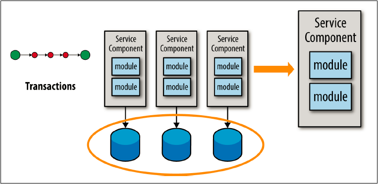

## データベーストランザクションの分析

サービスの粒度を検証するための次のテストは、ある操作におけるデータベーストランザクションの必要性を分析することです。
データベーストランザクションはより正式にはACIDトランザクション（atomicity：不可分性、consistency：一貫性、isolation：独立性、durability：永続性）
と呼ばれます。ACIDトランザクションは、複数のデータベース更新を１つの作業単位に調整します。
データベースの更新は、作業単位全体としてコミットされるか、エラー状態が発生した場合にはロールバックされます。

マイクロサービスアーキテクチャのサービスは分散され、別々なアプリケーションとしてデプロイされているため、
２つないしそれ以上のリモートサービス間のACIDトランザクションを維持することは困難を極めます。
このため、マイクロサービスアーキテクチャでは一般的に、BASEトランザクション（Basic Availability, Soft state, and
Eventual consistency）として知られる手法に頼ることになります。
にもかかわらず、幾つかの業務処理においてはACIDトランザクションが必要となる場面が出てくるでしょう。
あなたが、ACIDとBASEのトランザクションを取り巻く問題と常に格闘し、複数更新を調整する必要がある場合、サービスが細かすぎる可能性があります。

トランザクションの必要性を分析し、結果整合性を保つことができないと判明した場合は通常、
図5-3に示すように細かい粒度のサービスからより粗い粒度のサービスに移行し、単一のサービスで複数更新の調整を維持します。

図5-3. データベーストランザクション分析の影響

ACIDトランザクションの観点では、１つのデータベースに統合するか、個々のデータベースのままとするかは関係がないことに注意してください。
一般的にはデータベースの統合も必要になりますが、これはACIDトランザクションを維持するための要件ではありません。
（使用しているデータベースとトランザクションマネージャが2フェーズコミットのようなXAをサポートしていると仮定した場合）

トランザクションの必要性を分析したら、３番目のテストである、サービス・コレオグラフィーに進むべき時です。