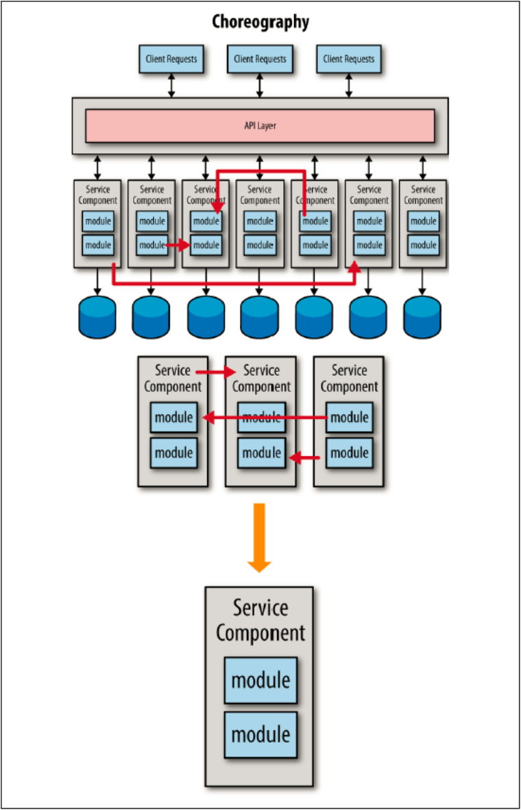

## サービス・コレオグラフィーの分析

サービスの粒度を検証するための３番目のテストは、サービス・コレオグラフィーです。
サービス・コレオグラフィーとは、一般的にはサービス間通信とも呼ばれるサービス間のやりとりのことです。
サービス・コレオグラフィーは、たいていはマイクロサービス・アーキテクチャにおいて慎重に扱いたい事項です。
まず、別なサービスを呼び出すのにリモート呼び出しを行う都度、アプリケーション全体のパフォーマンスは低下します。
例えば、別なサービスへのレストフルな呼び出しに100ミリ秒かかるとすると、５回のサービス呼び出しでは 「リモートアクセスの時間だけで」0.5秒かかることになります。

過度なサービス・コレオグラフィーに関するその他の問題は、システム全体の信頼性と堅牢性に影響を与える可能性があるということです。
１つのビジネスリクエストに対してより多くのリモートコールを行うほど、それらのリモートコールの１つが失敗したりタイムアウトする可能性が高くなります。
１つのビジネスリクエストを完了するのに非常に沢山のサービス連携が必要であるなら、おそらくサービスの粒度は細かすぎることになります。
サービス・コレオグラフィーのレベルを分析すると、図5-4に示すとおり細かい粒度のサービスからより粗い粒度のサービスに移行するでしょう。

  

図5-4. サービス・コレオグラフィー分析の影響

サービスを統合し、より粗い粒度のサービスに移行することで、パフォーマンスを向上させ、アプリケーション全体的の信頼性と堅牢性を向上させることができます。
また、サービス間の依存関係を排除し、より良い変更管理、テスト、およびデプロイを可能にします。

サービス・コレオグラフィーにおけるパフォーマンスと信頼性の問題を克服するためのもう１つのアプローチは、非同期並列処理と、エラー処理のためのリアクティブ・アーキテクチャー技術を組み合わせることです。
複数のリクエストを同時に実行することで、全体の応答性が向上し、１つのビジネスリクエストで複数のサービスを適時に調整することができます。
ここで重要な点は、サービス・コレオグラフィーに関連するトレードオフを理解し分析することで、ユーザーに対する十分な応答性と、システム全体の十分な信頼性の両方を保証するということです。