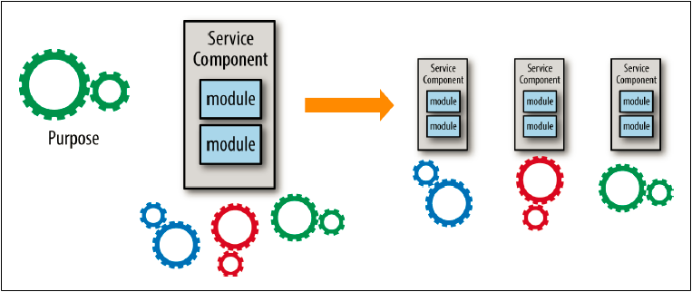

## サービスの範囲と機能の分析

サービスが適切な粒度かどうかを決めるための最初の方法はサービスの範囲と機能を分析することです。
サービスが何をするのか？何の操作をするのか？ドキュメントしたり言葉にすることはサービスがやりすぎていないかを決めるのにとても良い方法です。
"そして"とか"加えて"といった語句を使っている場合、通常はサービスがおそらくやりすぎていることを示す良い指針となります。

凝集性もまたサービスの範囲と機能における役割を果たします。凝集性はサービスのどの操作が相互に関係しているかの関連性を明確にします。
あなたは自サービスを高凝集性に保つよう努めたいでしょう。例えば、次のような操作を持つ顧客サービスを保有しているとします。

* add_customer
* update_customer
* get_customer
* notify_customer
* record_customer_comments
* get_customer_commnets

この例では、最初の３つの操作は、顧客情報の照会と更新という観点で相互関係にあります。
しかしながら、後の３つ（notify_customer, record_customer_comments, get_customer_commnets）
は基本的な顧客データに関する通常のCRUD操作とは関係がありません。このサービスにおける操作の凝集レベルを分析した結果、
おそらく３つのサービス（顧客メンテ、顧客通知、顧客コメント）に分割すべきであるということが明確になります。

一般的にはサービスの範囲と機能を分析することで、おそらくはサービス粒度が荒すぎたことがわかり、サービスはより細かい粒度へ移行していくことになるでしょう。
図5-2はその要点を説明しています。

図5-2. サービスの範囲と機能分析の影響

Sam Newmanはこの領域 — 荒いサービス粒度からよりきめ細かい粒度への移行 — についてのとても適切な提言をしています。
この提言に従うことで、粒度に悩まされすぎることなく直ちにサービスコンポーネント定義を始める助けとなるでしょう。
サービスの範囲と機能を分析することは良いスタートですが、あなたはそこで止めたくありません。サービスの範囲を見た後で、
次にあなたはデータベーストランザクションの必要性を分析する必要があります。
