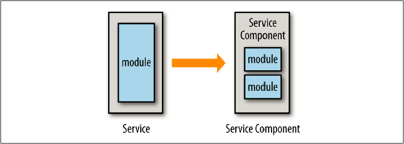

### CHAPTER 5

# ”砂のごとき細かい粒度”の落とし穴

マイクロサービスアーキテクチャでアプリケーションを作る際にアーキテクトや開発者が最も頭を悩ませるのはおそらく、サービスの粒度でしょう。
サービスはどの程度の大きさの粒度にするべきでしょうか？適切なサービス粒度を選択することは、どのようなマイクロサービスの成功を考える上でも必要不可欠です。
サービス粒度は性能、堅牢性、信頼性、変更容易性、テスト容易性、そして開発においても影響を及ぼします。

「砂のごとき細かい粒度」の落とし穴は、アーキテクトや開発者が細かすぎる粒度のサービスを作った時に起こります。
だけど待ってください、 ー それはそもそも*マイクロサービス*と呼ばれているのではなかったでしょうか？
「マイクロ」という言葉には、サービスはとても小さいものであるべきである、ということをほのめかしていますが、一体どのくらいの小ささが「小さい」といえるのでしょうか？

この落とし穴にはまる主要な理由の１つは開発者は往々にして*サービス*を*クラス*と混同してしまうということがあります。
私は、実装したクラスが実際にはサービスであるという考え方でサービスを作っている開発者チームを幾度となく見てきました。
誤解にもほどがあります。

サービスは常に*サービスコンポーネント*であると考えられるべきです。サービスコンポーネントとはシステムにおいて特定の機能を果たすアーキテクチャコンポーネントのことです。
サービスコンポーネントは明確で簡潔な役割と責務、一連の操作を持ちます。
どのようなサービスコンポーネントが実装されるべきか、またサービスにいくつのクラス実装が必要かは開発者次第です。

図5-1は、サービスコンポーネントは１つないしそれ以上のモジュール（例えばJavaのクラス群）で実装されることを示しています。
モジュールとサービスコンポーネントを1対1の関係性で実装してしまうと、細かすぎる粒度のコンポーネントになるばかりか、貧相なプログラミングの慣習までも引き起こします。
１つのクラスで実装されたサービスは肥大化し、過度な責務を持ったクラスを保持してしまう傾向にあり、メンテナンスやテストを困難にします。

図5-1. モジュールとサービスの関係性

クラス実装数はサービス粒度を表すべきではありません。いくつかのサービスはその業務機能の実装を１クラスファイルしか必要としないかもしれませんし、
一方で他のサービスは６ないしそれ以上のクラス数が必要となるかも知れません。
クラス実装数はサービス粒度の決定に何の影響も与えないというのであるならどうすればよいでしょうか？
幸いなことに、適切なサービスレベルの決定に役立つ基礎的な３つのテストがあります。
「サービスの範囲と機能」、「データベーストランザクションの必要性」、最後に「サービス・コレオグラフィーのレベル」です。
