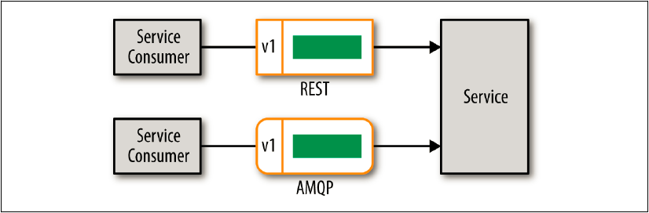

## ヘッダー・バージョニング

契約バージョン管理の最初の手法は、図8-1に示すように、リモートアクセスプロトコルのヘッダーに契約バージョン番号を入れることです。
使用している契約のバージョン情報がリモートアクセスプロトコル（REST、SOAP、AMQP、JMS、MSMQなど）のヘッダーに含まれているため、
これを**プロトコル対応バージョン管理**と呼んでいます。 



図8-1. ヘッダー・コントラクト・バージョニング

RESTを使用する場合は、**ベンダーMIMEタイプ**と呼ばれるものを使用して、リクエストのAcceptヘッダーに使用する契約のバージョンを指定できます。

```
POST /trade/buy
Accept: application/vnd.svc.trade.v2+json
```

URIのAcceptヘッダーにベンダーMIMEタイプ（vnd）を使用して契約のバージョン番号を指定することで、
サービスにその契約のバージョン番号に基づいて処理を実行するように指示できます。
これに対応して、サービスはバージョン番号を決定するためにAcceptヘッダを解析する必要があります。
この一例としては、正規表現を使用して以下に示すようにバージョンを見つけるということがあります。

```ruby
def version
request.headers
["Accept"][/^application/vnd.svc.trade.v(d)/, 1].to_i
end
```

残念ながらこれは簡単な部分です。困難な部分は、契約のバージョンに基づいてサービスの条件分岐処理
（例えば、`if version 1 then... else if version 2 then...`といったような処理）を行うコーディングの循環的複雑度です。
このため、各サービスに取り込む循環的複雑度のレベルを制御するために、ある種のバージョンの非推奨ポリシーが必要です。

メッセージングを使用する場合は、メッセージヘッダーのプロパティにバージョン番号を指定する必要があります。
JMS 2.0の場合、これは次のようになります。

```java
String msg = createJSON(
  "acct","12345",
  "sedol","2046251",
  "shares","1000")};

jmsContext.createProducer()
.setProperty("version", 2)
.send(queue, msg);
```

各メッセージング標準には、このヘッダーを設定する独自の方法があります。
ここで覚えておくべき重要なことは、メッセージングの標準に関係なく、バージョンプロパティは文字列値であり、大文字と小文字を区別することを含め、
サービスが期待しているものと正確に一致する必要があることです。
このため、ヘッダーにバージョン番号が見つからない場合、通常はデフォルトのバージョンを指定することはお勧めできません。
