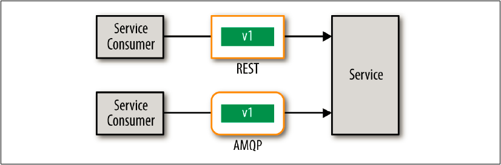

## スキーマ・バージョニング

もう１つの契約バージョン管理手法は、実際のスキーマ自体にバージョン番号を追加することです。
この手法を図8-2に示します。
バージョン識別はリモートアクセスプロトコルとは完全に独立しているため、通常、この手法は**プロトコルに依存しない契約バージョン管理**と呼んでいます。
バージョン管理を使用するのに、リモートアクセスプロトコルのヘッダーに何も指定する必要はありません。



図8-2. スキーマベース・コントラクト・バージョニング

スキーマベースのバージョニングを使用すると、前の例で使用したスキーマは次のようになります。

```javascript
{
    "$schema": "http://json-schema.org/draft-04/schema#",
    "properties": {
      "version": {"type": "integer"},
      "acct": {"type": "number"},
      "cusip": {"type": "string"},
      "sedol": {"type": "string"},
      "shares": {"type": "number", "minimum": 100}
    },
     "required": ["version", "acct", "shares"]
}
```

スキーマには、実際にバージョン番号フィールド（バージョン）が整数値として含まれてることに注目してください。
今はスキーマが１つしかないので、全ての可能性のある組み合わせをスキーマに追加する必要があります。
上記の例では、バージョン間で異なるためCUSIPとSEDOLの両方がスキーマに追加されています。

この手法の大きな利点は、スキーマ（バージョンを含む）がリモートアクセスプロトコルから独立していることです。
これは、複数のプロトコルでまったく同じスキーマを使用できることを意味します。
例えば、RESTとJMS 2.0では、リモートアクセスプロトコルヘッダーを変更せずに同じスキーマを使用できます。

REST：
```javascript
POST /trade/buy
Accept: application/json
{ "version": "2",
  "acct": "12345",
  "sedol": "2046251",
  "shares": "1000" }
```

JMS 2.0：
```javascript
String msg = createJSON(
  "version","2",
  "acct","12345",
  "sedol","2046251",
  "shares","1000")};
jmsContext.createProducer().send(queue, msg);   
```

残念なことに、この手法には多くの欠点があります。
まず、メッセージの実際のペイロードを解析してバージョン番号を抽出する必要があります。
これは、XMLアプライアンス（例えば、DataPower）のようなものをルーティングに使用できなくなり、スキーマ（特にXML）を解析する際に問題が発生する可能性があります。
第2に、スキーマが非常に複雑になり、スキーマの自動変換（JSONからJavaオブジェクトなど）が困難になります。
最後に、サービスでスキーマを検証するためのカスタムバリデーションが必要な場合があります。
上記の例では、サービスはバージョン番号に基づいてCUSIPまたはSEDOLのいずれかが設定されていることを検証する必要があります。
